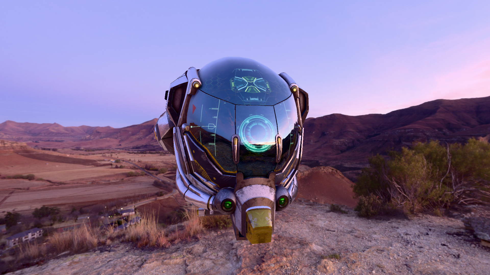
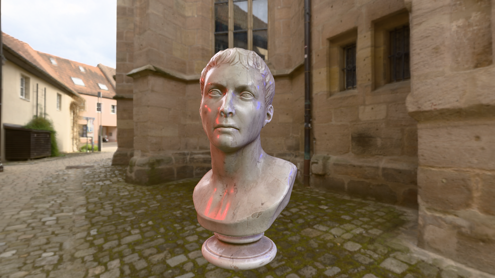
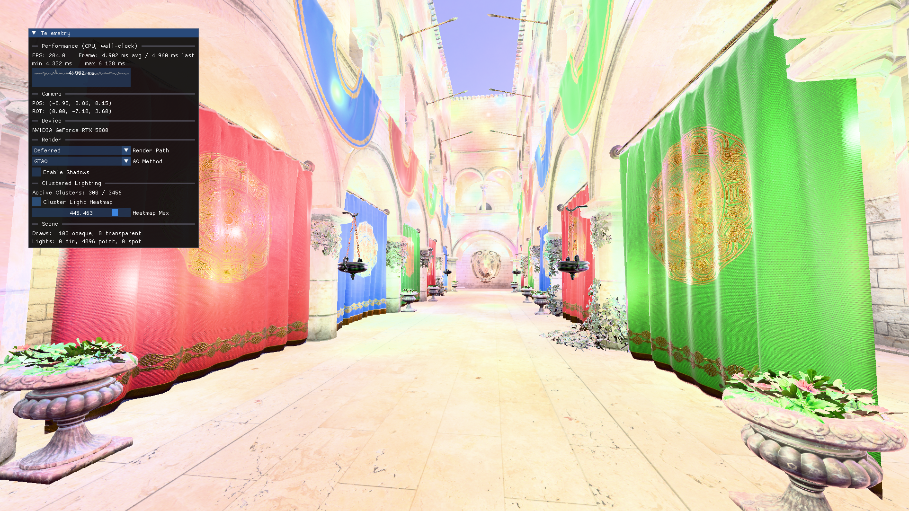
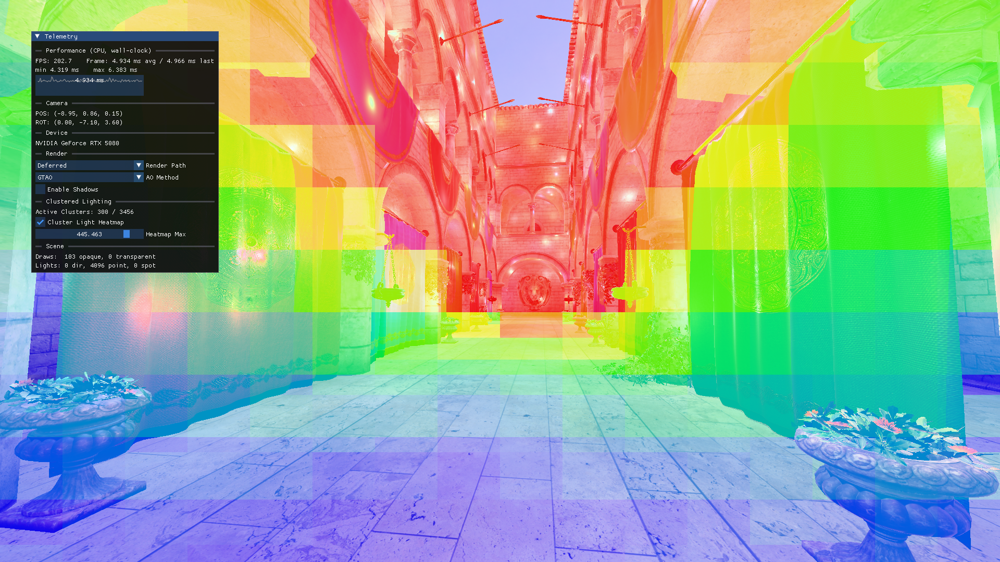
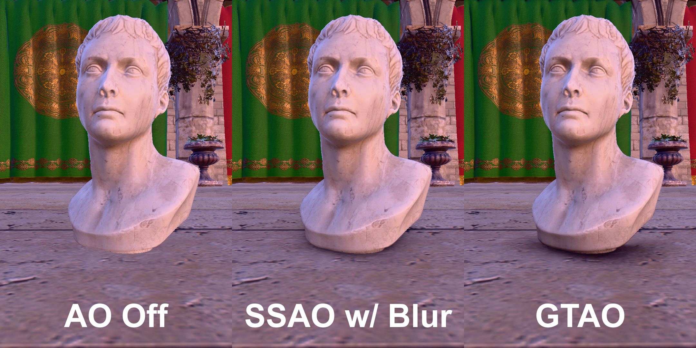
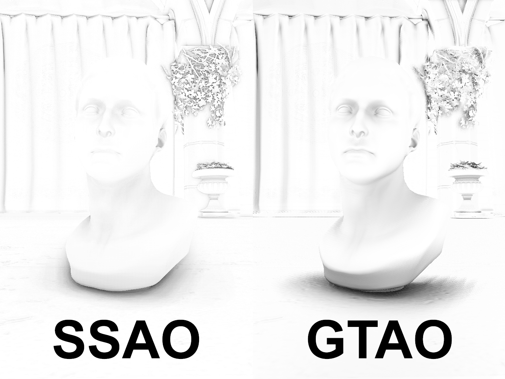
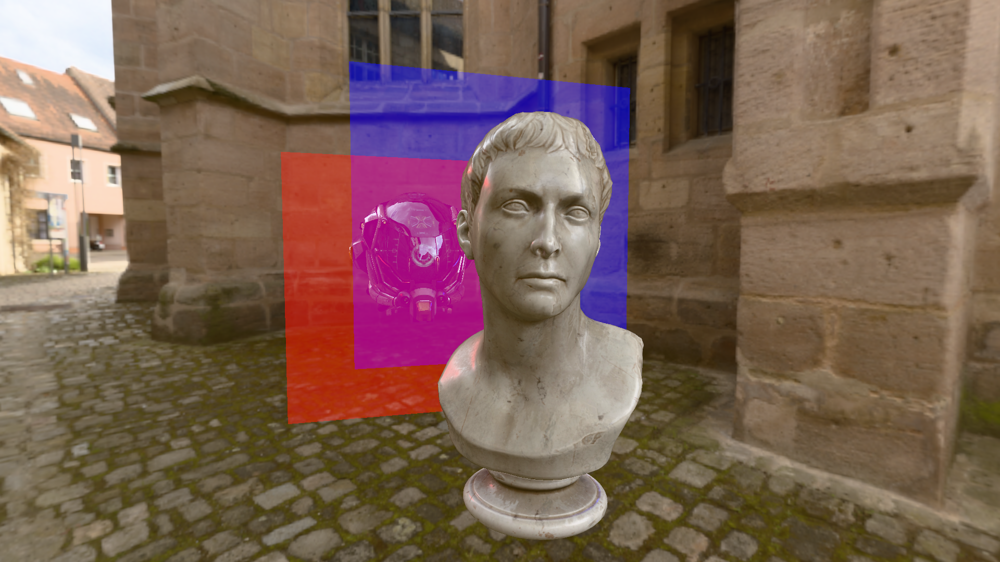

# utah
*utah* is a renderer project written in modern C++ and Vulkan 1.3. It implements clustered deferred shading, PBR + IBL, shadow mapping, GTAO, with all shaders authored in HLSL.

## Render Showcase
### Physically Based Rendering, with Image Based Lighting

### Clustered Deferred Shading

### Ambient Occlusion

### Blending

*All results measured on Windows 11 x64 - MSVC 2022 - Core Ultra 7 270K Plus - RTX 5080*
## Features Implemented
### Rendering Pipeline
- Clustered Deferred Shading
- Forward Shading for Transparency Handling
- Reverse-Z Depth
### Lighting & Shading
- Physically Based Rendering, with Image Based Lighting
- Directional, Spot, Point Lights
- Tone Mapping (Khronos PBR Neutral)
- HDR Environment Skybox
- Alpha Masking, Blending
### Shadows
- Shadow Maps for Directional, Spot, Point Lights
- Percentage-Closer Filtering, Slop-Scaled Bias
## Ambient Occlusion
- SSAO
- GTAO
### Vulkan & Resource
- Bindless Textures via Descriptor Indexing
- Dynamic Rendering, Sync2, RAII Bindings, VMA
### Tooling & Debug
- Dear ImGUI Integration
- HLSL Compilation through DXC, Shader Hot Reload
## Libraries Used
- [Vulkan SDK](https://vulkan.lunarg.com/)
- [Vulkan Memory Allocator](https://github.com/GPUOpen-LibrariesAndSDKs/VulkanMemoryAllocator)
- [GLFW](https://github.com/glfw/glfw)
- [GLM](https://github.com/g-truc/glm)
- [fastgltf](https://github.com/spnda/fastgltf)
- [tinyobjloader](https://github.com/tinyobjloader/tinyobjloader)
- [stb_image](https://github.com/nothings/stb)
- [Dear ImGui](https://github.com/ocornut/imgui)
- [NVIDIA Nsight Aftermath](https://developer.nvidia.com/nsight-aftermath)
## References & Resources
- LearnOpenGL by Joey De Vries (https://learnopengl.com/)
- Vulkan Tutorial by Alexander Overvoorde (https://vulkan-tutorial.com/)
- Official Vulkan Documentation (https://docs.vulkan.org/spec/latest/index.html)
- Vulkan C++ examples and demos by Sascha Willems (https://github.com/SaschaWillems/Vulkan)
- Vulkanised 2024: Common Mistakes When Learning Vulkan by Charles Giessen (https://www.youtube.com/watch?v=0OqJtPnkfC8)
- Vulkanised 2025: So You Want to Write a Vulkan Renderer in 2025 by Charles Giessen (https://www.youtube.com/watch?v=7CtjMfDdTdg)
- Vulkanised 2026: Vulkan Now and Then (for Hobbyists) by Sascha Willems (https://www.youtube.com/watch?v=EshkHyYxb3A)
- Practical Real-Time Strategies for Accurate Indirect Occlusion — Jimenez, Wu, Pesce, Jarabo, SIGGRAPH 2016 Courses (GTAO)
- XeGTAO — Intel GameTechDev reference implementation (https://github.com/GameTechDev/XeGTAO)
- Clustered Deferred and Forward Shading — Olsson, Billeter, Assarsson, HPG 2012
## Trivia
I've apparently commited to naming my projects after places, and for a renderer, no other name than "utah" was ever in the running.
